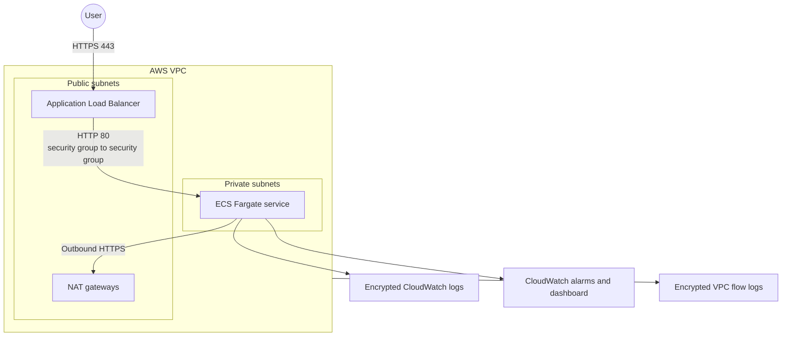

# AWS Terragrunt Reference Architecture

[](https://github.com/aadi308/aws-terragrunt-reference-architecture/actions/workflows/validate.yml)

I built this repository to show how I would organize a small AWS platform that has more than one environment. The example runs an ECS Fargate service behind an Application Load Balancer, with networking, security groups, logging, and monitoring managed as code.

The code is intentionally small enough to review in one sitting. It is a reference architecture, not a production-ready platform or a one-click deployment.

## The problem I wanted to solve

Terraform is easy to start with, but a repository can become repetitive once dev, staging, and production are added. Teams often end up copying the same configuration three times. Those copies eventually drift, and a simple network or security change has to be made in several places.

Here, Terraform modules own the AWS resources and Terragrunt connects those modules to each environment. Shared settings live in one place, while the values that should differ—CIDR ranges, task counts, retention periods, and deletion protection—stay visible in each environment file.

## What this creates

- A separate VPC for dev, staging, and production
- Public and private subnets across two or three Availability Zones
- An internet-facing Application Load Balancer with HTTPS only
- ECS Fargate tasks in private subnets with no public IP addresses
- Explicit route tables and one NAT gateway per Availability Zone
- Security groups that allow application traffic only from the load balancer
- Encrypted application logs and VPC flow logs in CloudWatch
- CloudWatch alarms for CPU, memory, and target 5xx responses
- A small CloudWatch service-health dashboard



Only the load balancer is reachable from the internet. The containers stay in private subnets and receive traffic through a security-group reference rather than a broad CIDR rule.

## Repository layout

```text
.
├── .github/workflows/validate.yml
├── live
│   ├── _env
│   │   ├── alb-security-group.hcl
│   │   ├── ecs.hcl
│   │   ├── monitoring.hcl
│   │   ├── network.hcl
│   │   └── service-security-group.hcl
│   ├── dev
│   │   ├── environment.hcl
│   │   └── us-east-1/
│   ├── staging
│   │   ├── environment.hcl
│   │   └── us-east-1/
│   ├── production
│   │   ├── environment.hcl
│   │   └── us-east-1/
│   └── root.hcl
├── modules
│   ├── ecs-fargate
│   ├── monitoring
│   ├── network
│   └── security-group
├── .checkov.yml
├── .env.example
├── .gitignore
├── .tflint.hcl
├── LICENSE
├── Makefile
└── README.md
```

The `modules` directory contains reusable Terraform. The `live` directory describes how those modules are used in each environment.

## Why Terragrunt is here

Terragrunt handles the parts I do not want repeated in every component:

- `live/root.hcl` generates the AWS provider and remote-state configuration.
- `live/_env` contains shared configuration and dependency wiring for each component type.
- Each `environment.hcl` contains the values specific to that environment.
- The small leaf `terragrunt.hcl` files choose the root and component configuration to inherit.

Terragrunt also passes outputs between components. For example, the network creates subnet IDs, the ECS configuration consumes them, and the monitoring configuration consumes the ECS and load-balancer names.

Each component gets its own state key from `path_relative_to_include()`. Dev, staging, and production also use different VPC CIDRs. In a real organization, I would strengthen this boundary further by placing each environment in a separate AWS account with its own state bucket.

## Environment differences

| Setting | Dev | Staging | Production |
|---|---:|---:|---:|
| Availability Zones | 2 | 2 | 3 |
| Desired tasks | 1 | 2 | 3 |
| Task CPU | 256 | 256 | 512 |
| Task memory | 512 MiB | 512 MiB | 1024 MiB |
| ALB deletion protection | Off | Off | On |
| Log retention | 365 days | 365 days | 365 days |

These values are examples. They are meant to make the environment boundaries easy to see, not to recommend a particular production capacity.

## Security choices

- Fargate tasks run privately and do not receive public IP addresses.
- The load balancer accepts HTTPS using an ACM certificate supplied at runtime.
- The service accepts port 80 only from the load balancer security group.
- Container egress is limited to HTTPS.
- The container root filesystem is read-only, and ECS Exec is disabled.
- The application task role starts with no permissions.
- The execution role can write only to the service's CloudWatch log group.
- Application logs and VPC flow logs use customer-managed KMS keys with rotation enabled.
- The default VPC security group is managed as deny-all.
- Terraform state, plans, variable files, credentials, private keys, generated providers, and Terragrunt caches are ignored by Git.

The backend still needs to be created separately. Treat state as sensitive data even when Terraform outputs are marked `sensitive`. A real state bucket should have encryption, versioning, public-access blocking, restricted policies, and recovery controls.

No AWS credentials are stored in this repository. Use short-lived credentials from IAM Identity Center or an assumed role. For CI deployment, use GitHub OIDC instead of long-lived access keys.

## Before you start

Install the following tools:

- [Terraform](https://developer.hashicorp.com/terraform/install) `>= 1.5.7, < 2.0`
- [Terragrunt](https://terragrunt.gruntwork.io/docs/getting-started/install/) `0.99.x` or a compatible version
- AWS CLI v2
- TFLint
- Checkov
- Gitleaks

To deploy, you will also need an encrypted S3 state bucket, a DynamoDB lock table, and an ACM certificate in the target region. The repository uses obvious placeholders for these values.

## Clone and validate

```bash
git clone https://github.com/aadi308/aws-terragrunt-reference-architecture.git
cd aws-terragrunt-reference-architecture
```

Run all local checks:

```bash
make check
```

Or run them separately:

```bash
make fmt-check
make validate
make lint
make security
make secrets
```

These checks do not create AWS resources. Terraform initialization downloads providers, so it still needs internet access.

## Configure an environment

Export the backend and certificate placeholders in your shell. Do not put real values in a committed `.env` file.

```bash
export AWS_PROFILE="replace-me"
export TF_STATE_BUCKET="replace-me-terraform-state-bucket"
export TF_LOCK_TABLE="replace-me-terraform-lock-table"
export TF_VAR_certificate_arn="arn:aws:acm:us-east-1:000000000000:certificate/replace-me"
```

Before planning, check the environment file you intend to use. For dev, that is `live/dev/environment.hcl`.

## Plan and apply

Plan the complete dev dependency graph:

```bash
cd live/dev/us-east-1
terragrunt run --all plan
```

You can also work with one component from its own directory:

```bash
cd live/dev/us-east-1/network
terragrunt init
terragrunt plan
```

Review the complete plan and the cost implications before applying anything:

```bash
cd live/dev/us-east-1
terragrunt run --all apply
```

## CI checks

The GitHub Actions workflow runs on pushes to `main` and on pull requests. It checks:

1. Terraform formatting
2. Terragrunt formatting
3. Terraform validation for every module
4. TFLint and its AWS rules
5. Gitleaks secret scanning
6. Checkov security policies

The workflow has read-only repository permissions. It validates the code but does not authenticate to AWS, create a plan, or deploy resources.

## Cost warning

This architecture is not free to run. NAT gateways, the load balancer, Fargate tasks, CloudWatch logs, and KMS keys all create charges. NAT gateways are likely to be the largest fixed expense for a small demo, and the production example creates three of them.

Check the current AWS Pricing Calculator before deploying. For a cheaper networking-only review, set `enable_nat_gateway = false` and do not deploy ECS. Another option is to add VPC endpoints for ECR, CloudWatch Logs, and S3, but endpoints also have hourly costs. Compare both designs for your region and expected traffic.

## Clean up

Production enables ALB deletion protection. Set it to `false`, apply that change, and review the result before destroying production.

For dev:

```bash
cd live/dev/us-east-1
terragrunt run --all destroy
```

After destroy completes, check for leftover NAT gateways, Elastic IP addresses, load balancers, ECS tasks, log groups, alarms, dashboards, and KMS keys. KMS keys remain in a 30-day pending-deletion period. Remote state is deliberately retained and should be handled according to your recovery policy.

## Trade-offs and next steps

I kept this repository focused on the core path from networking to a running container. It does not yet include:

- Route 53 and certificate automation
- AWS WAF or ALB access-log storage
- A private ECR repository and image scanning
- VPC endpoints
- ECS autoscaling
- Application secrets or tracing
- GitHub OIDC deployment roles and approval gates
- Automated integration tests or disaster-recovery exercises

The public container image is pinned to a version tag for readability. Production workloads should use an approved private image pinned by digest. Checkov exceptions beside the ALB and KMS policies document the few deliberate scanner exceptions and explain why they exist.

## What I would discuss in an interview

- How Terragrunt inheritance keeps shared configuration in one place
- Why each component has separate state and explicit dependencies
- Why the load balancer is public but the workload is private
- How security-group references are narrower than VPC-wide ingress
- When per-AZ NAT gateways are worth their cost
- What I would add before allowing CI to deploy to production

## Professional context

The structure is inspired by patterns I used in production work where infrastructure provisioning time was reduced by approximately 60%. That result came from the professional implementation and its surrounding delivery process. This public reference repository is a separate demonstration; I am not claiming that the demo itself produced the same result.

## References

- [Terragrunt documentation](https://terragrunt.gruntwork.io/docs/)
- [Terragrunt quick start](https://terragrunt.gruntwork.io/docs/getting-started/quick-start/)
- [Terraform AWS tutorials](https://developer.hashicorp.com/terraform/tutorials/aws-get-started)
- [AWS Fargate documentation](https://docs.aws.amazon.com/AmazonECS/latest/developerguide/AWS_Fargate.html)

## License

MIT. See [LICENSE](LICENSE).
